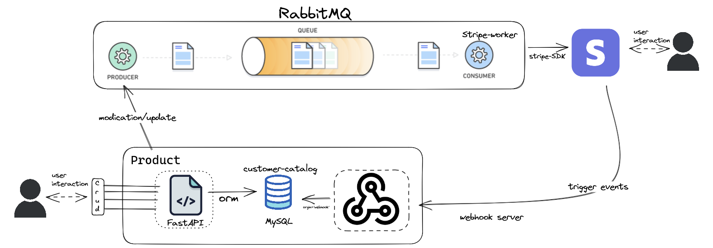

# Two-Way-Integration

The objective of this exercise is to simulate a product that you are building that has a simple
customer catalog (think of it as a simple customer table) and build a two-way integration with a
customer catalog in an external service - Stripe in this case.

## Process Flow


## Tech Stack

python | rabbitmq | fastapi | mysql
:-------------------------:|:-------------------------: | :---: | :---:
 |  |  | 


## Environment Variables

To run this project, you will need to add the following environment variables to your .env file

`SQL_ENGINE_URI`: of the form `<dbms_type> + <dbms_driver>://<username>:<password>@<IP>:<PORT>/<database_name>`

`STRIPE_RESTRICTED_KEY`: use API key or generate restricted key from stripe dashboard

`WEBHOOK_SECRET`: see setup stripe webhook section below
## Run Locally

Clone the project

```bash
  git clone https://github.com/sameeriron42/two-way-integration.git
```

Go to the project directory

```bash
  cd two-way-integration
```

Install dependencies

```bash
  pip install -r requirements.txt
```

set PYTHONPATH environment variable for modules imports
 
```
  export PYTHONPATH="${PYTHONPATH}:/path/to/your/project/"
```

- start mysql daemon
- start RabbitMQ service
- cd `app/`

Start the Product, in this case CRUD API
```bash
  uvicorn app:app --reload
```
Start stripe worker (on seperate terminal instance)
```bash
  cd app/queues/
  py -m stripe_worker.py
```
Start Webhook handler (seperate terminal instance)

```bash
  cd app/webhook
  uvicorn main:app --port 5005 --reload
```
Expose the webhook server using ngrok
```bash
    ngrok http 5005
```
### Setup Stripe webhook
- Navigate to stripe dashboard on test account
- on developers->Webhook section add new webhook
- under customer events, select 
- `customer.created`
- `customer.update`
- `customr.deleted`
- use the tunnel link generated by ngrok, paste it in webhook section of stripe 
- Name it as customer-hook, click create webhook. copy the WEBHOOK SECRET generated.
