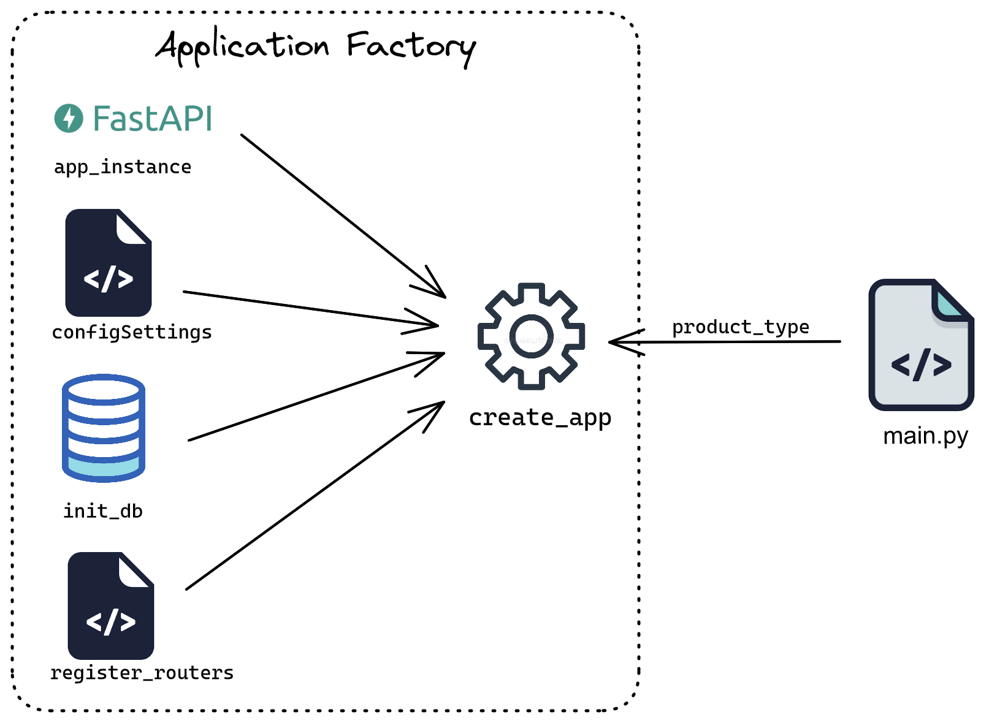
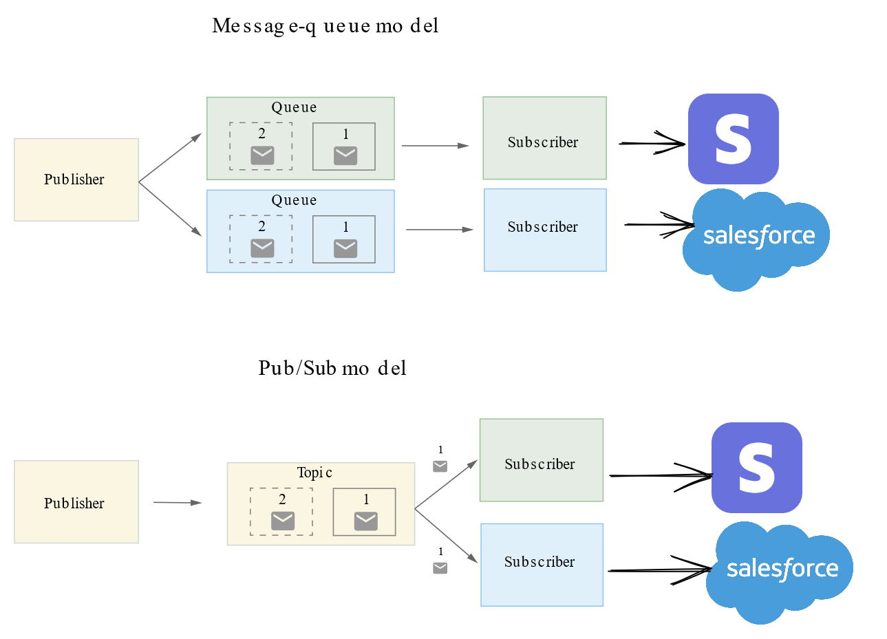

# Two-Way-Integration

A two-way-sync between your application and remote service. Lets say for example your application maintains details of all its users. From the application we are able to perform CRUD operations using endpoint or web interface which will reflect in our database. Now we want this changes to propagate to any remote service that we subscribed to, like Stripe(payment service platform). Similarly performing CRUD operations on the remote side ex. from Stripe dashboard, should reflect in our application database.

## Factory Pattern Architecture

## Process Flow

- Updates made usign CRUD api is reflected on mySQL database using ORM.
- Parallely a message payload is sent to the exchange of Queueing service(RabbitMQ).
- Worker consumes these messages from queue and make calls to appropriate remote service API using their SDK's.
- Updates made on remote end will trigger our webhook(we must configure which events to listen for). 
- Webhook acts in same way as our CRUD api making changes to our DB, without publishing msg to queue.
## Tech Stack

python | rabbitmq | fastapi | mysql
:-------------------------:|:-------------------------: | :---: | :---:
 |  |  | 

## Environment Variables

To run this project, you will need to add the following environment variables to your .env file

`SQL_ENGINE_URI`: of the form `<dbms_type> + <dbms_driver>://<username>:<password>@<IP>:<PORT>/<database_name>`

`STRIPE_RESTRICTED_KEY`: use API key or generate restricted key from stripe dashboard

`WEBHOOK_SECRET`: see setup stripe webhook section below
## Run Locally

Clone the project

```bash
  git clone https://github.com/sameeriron42/two-way-integration.git
```

Go to the project directory

```bash
  cd two-way-integration
```

Install dependencies

```bash
  pip install -r requirements.txt
```

Set PYTHONPATH environment variable for modules imports

**For UNIX (Linux, OSX, ...)**
```bash
export PYTHONPATH="${PYTHONPATH}:/path/to/your/project/app"
```
**For Windows**
```bash
set PYTHONPATH=%PYTHONPATH%;C:<\path\to\your\project\>\app
 ```

- start mysql daemon
- start RabbitMQ service
- cd `app/`

Start the Product, in this case CRUD API
```bash
  uvicorn app:app --reload
```
Start stripe worker (on seperate terminal instance)
```bash
  cd app/queues/
  py -m stripe_worker.py
```
Start Webhook handler (seperate terminal instance)

```bash
  cd app/webhook
  uvicorn main:app --port 5005 --reload
```
Expose the webhook server using ngrok
```bash
    ngrok http 5005
```
### Setup Stripe webhook
- Navigate to stripe dashboard on test account
- on developers->Webhook section add new webhook
- under 
events, select 
- `customer.created`
- `customer.update`
- `customr.deleted`
- use the tunnel link generated by ngrok, paste it in webhook section of stripe 
- Name it as customer-hook, click create webhook. copy the WEBHOOK SECRET generated.


### How can application's user details be extended to support other systems like product details?
- Since we follow factory pattern, we can seamlessly integrate any new category as long as we define templates such as routers,configSettings,DB models & schemas.
- When provided with system type, Our factory function will take care of the integrations i.e, initializing appropriate configClass and registering product related routers,publishing msg's to respective queues etc.

### How would you go about adding second integration like salesforce?
- All we need to do is extend the functionality of worker that we wrote for stripe integration.
- So that when a message is received the worker makes respective api call to both stripe and salesforce with their respective SDK's.
- But a better design would be to add seperate worker for salesforce and let the message queue work in Pub/Sub fashion.

- we can acheive this by using `fanout` option in rabbitMQ. So that all the workers that we binded to particular exchange get to work on same msg received in queue. Apache Kafka is a well suited solution for this type of model.
- This will take care of the outward sync part. For the inward sync instead of having single `/webhook` endpoint.
- We will define two seperate routes `/webhook/stripe` and `/webhook/salesforce`. Add these routes in respective service dashboard when we create new webhook trigger.


